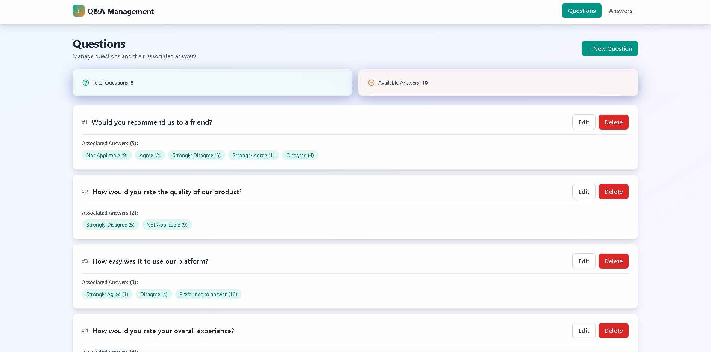

# Q&A Management System

Sistema de gerenciamento de perguntas e respostas construído com **React 18 + TypeScript + Vite** (frontend)



## 🎯 Funcionalidades

- ✅ CRUD completo de Respostas (Answers)
- ✅ CRUD completo de Perguntas (Questions)
- ✅ Associação ManyToMany entre Questions e Answers
- ✅ Cascading delete (ao deletar uma resposta, ela é removida de todas as perguntas)
- ✅ Validação com Zod
- ✅ UI moderna com Tailwind CSS e efeitos Glassmorphism
- ✅ Acessibilidade WCAG 2.1 AA
- ✅ TypeScript strict mode
- ✅ TanStack Query para gerenciamento de estado assíncrono

## 🚀 Como Executar

### Pré-requisitos

- Node.js 18+
- npm ou yarn

### 1️⃣ Instalação das Dependências

```bash
# Frontend (em outro terminal)
cd frontend
npm install
```

### 2️⃣ Configuração do Ambiente

```bash
# Frontend
cd frontend
cp .env.example .env
```

### 4️⃣ Executar os Servidores

```bash
# Frontend
cd frontend
npm run dev
# Aplicação rodando em http://localhost:5173
```

### 5️⃣ Acessar a Aplicação

Abra o navegador em: **http://localhost:5173**


## 📁 Estrutura do Projeto

```
├──frontend/
    ├── src/
    │   ├── layout/          # Navbar, Layout
    │   ├── modules/
    │   │   ├── answers/     # Módulo de Respostas
    │   │   │   ├── components/
    │   │   │   ├── hooks/
    │   │   │   ├── services/
    │   │   │   ├── types/
    │   │   │   └── validators/
    │   │   └── questions/   # Módulo de Perguntas
    │   │       ├── components/
    │   │       ├── hooks/
    │   │       ├── services/
    │   │       ├── types/
    │   │       └── validators/
    │   ├── shared/          # Componentes e utils compartilhados
    │   │   ├── components/  # Button, Card, Input, Modal, Spinner
    │   │   └── utils/       # API client
    │   ├── styles/          # CSS Global (Tailwind)
    │   ├── App.tsx          # Rotas
    │   └── main.tsx         # Entry point
    └── public/
```

## 🛠️ Stack Tecnológico

### Frontend
- **React 18** - UI Library
- **TypeScript 5** - Type Safety
- **Vite 5** - Build Tool
- **React Router 6** - Routing
- **TanStack Query 5** - Server State Management
- **React Hook Form 7** - Form Management
- **Zod 3** - Schema Validation
- **Tailwind CSS 3** - Styling
- **Axios** - HTTP Client

## 🎨 Design System

- **Paleta de Cores**: Primary (Greens), Accent (Oranges)
- **Estilo**: Modern Minimalism + Glassmorphism
- **Acessibilidade**: WCAG 2.1 AA compliant
- **Responsivo**: Mobile-first approach

## 🧑🏾‍💻 Autor / Author

Matheus Gomes de Souza  
LinkedIn: https://www.linkedin.com/in/matheus-gomes-de-souza/  
E-mail: matheusg_souza@outlook.com
